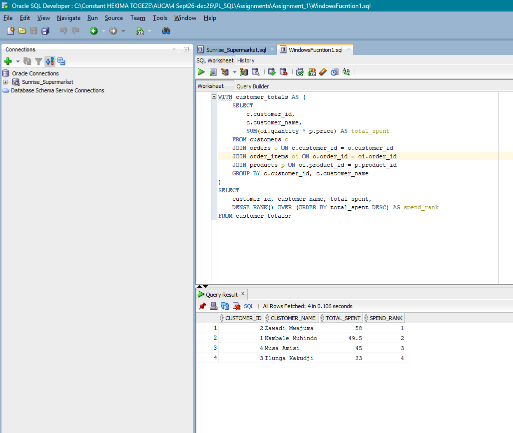
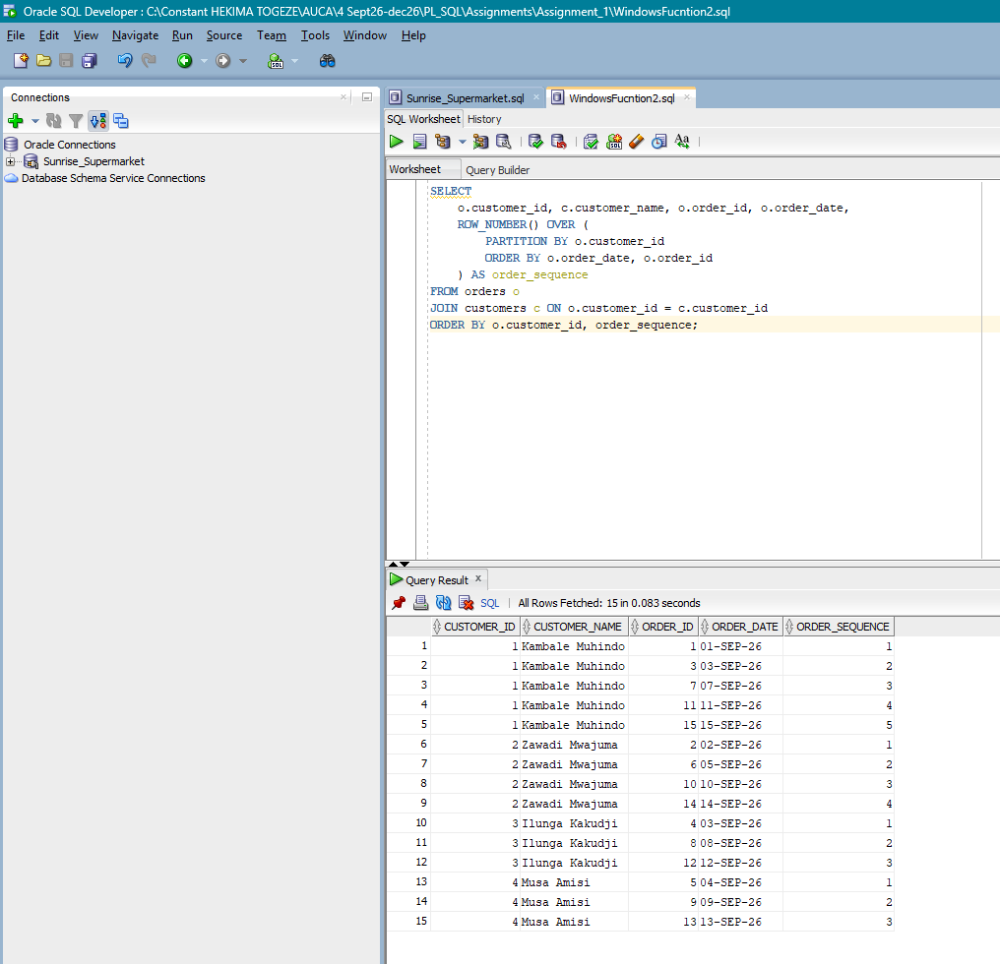
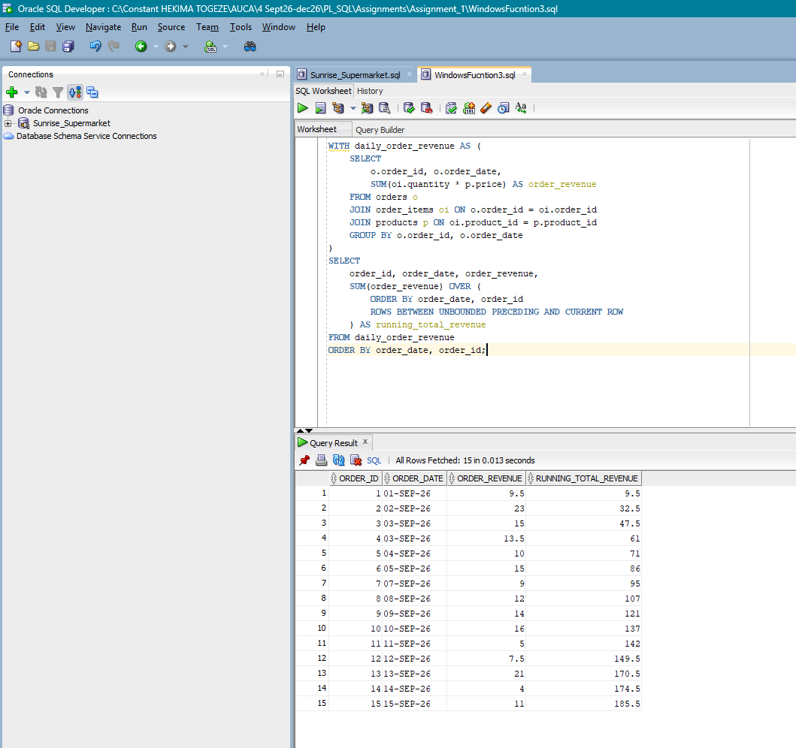
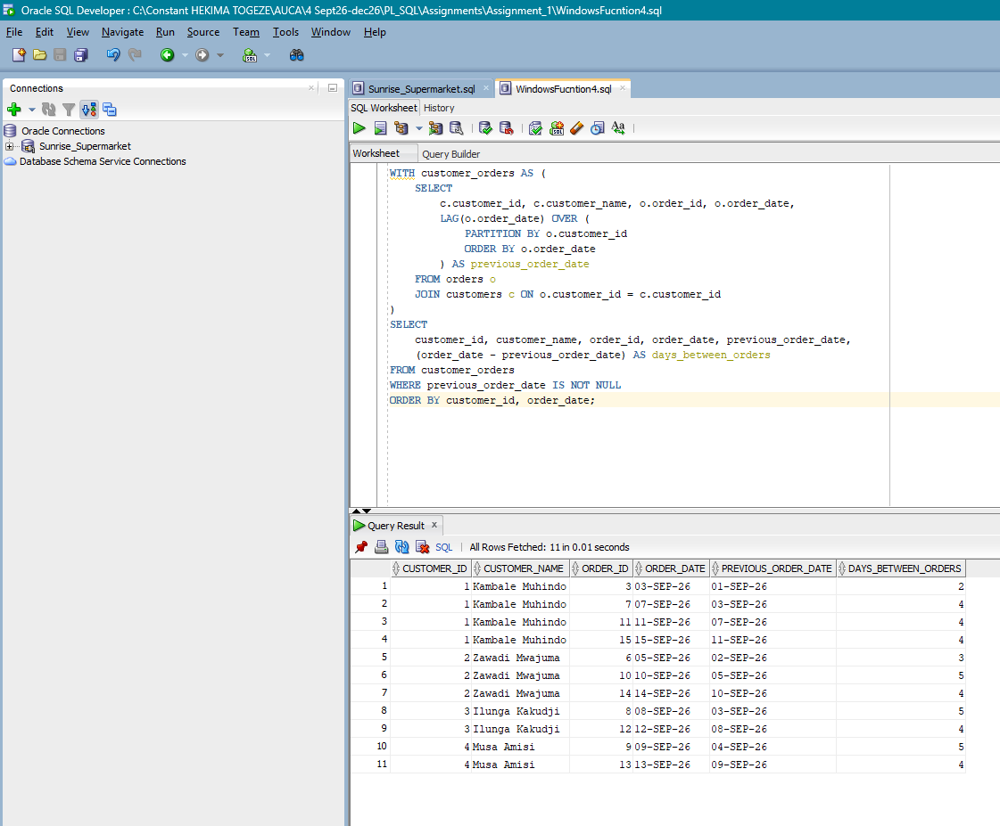

# PLSQL Assignment One / Sunrise Supermarket

**Student Name:** HEKIMA TOGEZE Constant
**Student ID:** 29136
**Group:** Group B
**Database Tool Used:** Oracle SQL

---

## Short Summary
This project manages and analyzes purchase patterns for **Sunrise Supermarket**. It implements a relational database design containing customers, products, orders, and order items tables. Using SQL techniques including Inner/Left Joins, Common Table Expressions (CTEs), and Window Functions (`DENSE_RANK`, `ROW_NUMBER`, `SUM OVER`, `LAG`) the project extracts actionable business intelligence on customer purchasing behavior, repeat order frequency, and cumulative revenue growth.

---

## How to Run
1. Open your SQL Developer for Oracle db like this one.
2. Execute the table creation DDL statements provided in the assignment.
3. Run the data insertion scripts to populate tables with initial records.
4. Run each section of the analysis script (Joins, CTE, Window Functions) sequentially.

---

## Business Scenario
Sunrise Supermarket is expanding operations and requires insights into sales performance. Management wants to:
* Track which customers place orders and their geographical locations.
* Identify high-value customers spending above the average baseline.
* Evaluate customer retention by analyzing time elapsed between orders.
* Monitor total dynamic sales growth over time.

---

## Queries, Explanations & Results

### 1. JOIN Queries

#### Query 1.1: Orders with Customer Details (INNER JOIN)
* **Explanation:** Combines `orders` and `customers` to map each order to a specific customer and their city.
* **SQL Query:**
```sql
SELECT
    o.order_id,
    c.customer_name,
    c.city,
    o.order_date
FROM orders o
INNER JOIN customers c ON o.customer_id = c.customer_id
ORDER BY o.order_id;
```
* **Result Screenshot**


#### Query 1.2: Order Items with Product Info (JOIN)
* **Explanation:** Links itemized order lines (`order_items`) with item descriptions and prices from `products`.
* **SQL Query:**
```sql
SELECT 
    oi.order_item_id,
    oi.order_id,
    p.product_name,
    p.category,
    p.price,
    oi.quantity
FROM order_items oi
JOIN products p ON oi.product_id = p.product_id
ORDER BY oi.order_item_id;
```
* **Result Screenshot**


#### Query 1.3: Complete Customer Order History (LEFT JOIN)
* **Explanation:** Retrieves all registered customers, including inactive ones who haven't placed an order yet.
* **SQL Query:**
```sql
SELECT 
    c.customer_id,
    c.customer_name,
    o.order_id,
    o.order_date
FROM customers c
LEFT JOIN orders o ON c.customer_id = o.customer_id
ORDER BY c.customer_id, o.order_date;
```
* **Result Screenshot**


---

### 2. CTE Query

#### Query 2.1: Customers Spending Above Average
* **Explanation:** Uses a CTE (`CustomerSpend`) to compute individual totals, then filters for customers exceeding the overall average spend.
* **SQL Query:**
```sql
WITH CustomerSpend AS (
    SELECT
        c.customer_id,
        c.customer_name,
        NVL(SUM(oi.quantity * p.price), 0) AS total_spend
    FROM customers c
    LEFT JOIN orders o ON c.customer_id = o.customer_id
    LEFT JOIN order_items oi ON o.order_id = oi.order_id
    LEFT JOIN products p ON oi.product_id = p.product_id
    GROUP BY c.customer_id, c.customer_name
),
AverageSpend AS (
    SELECT AVG(total_spend) AS avg_spend 
    FROM CustomerSpend
)
SELECT 
    cs.customer_id,
    cs.customer_name,
    cs.total_spend
FROM CustomerSpend cs, AverageSpend asp
WHERE cs.total_spend > asp.avg_spend
ORDER BY cs.total_spend DESC;
```
* **Result Screenshot**


---

### 3. Window-Function Queries

#### Query 3.1: Rank Customers by Spend (`DENSE_RANK`)
* **Explanation:** Ranks customers from highest spender to lowest based on accumulated expenditure.
* **SQL Query:**
```sql
WITH CustomerTotals AS (
    SELECT 
        c.customer_id,
        c.customer_name,
        NVL(SUM(oi.quantity * p.price), 0) AS total_spent
    FROM customers c
    LEFT JOIN orders o ON c.customer_id = o.customer_id
    LEFT JOIN order_items oi ON o.order_id = oi.order_id
    LEFT JOIN products p ON oi.product_id = p.product_id
    GROUP BY c.customer_id, c.customer_name
)
SELECT 
    customer_id,
    customer_name,
    total_spent,
    DENSE_RANK() OVER (ORDER BY total_spent DESC) AS spend_rank
FROM CustomerTotals;
```
* **Result Screenshot**


#### Query 3.2: Customer Order Sequence (`ROW_NUMBER`)
* **Explanation:** Assigns a sequential order count to each transaction per customer ordered chronologically.
* **SQL Query:**
```sql
SELECT 
    customer_id,
    order_id,
    order_date,
    ROW_NUMBER() OVER (
        PARTITION BY customer_id 
        ORDER BY order_date ASC, order_id ASC
    ) AS order_sequence
FROM orders;
```
* **Result Screenshot**


#### Query 3.3: Running Total of Revenue (`SUM OVER`)
* **Explanation:** Computes a running aggregate of supermarket sales over time.
* **SQL Query:**
```sql
WITH DailyRevenue AS (
    SELECT 
        o.order_date,
        SUM(oi.quantity * p.price) AS daily_sales
    FROM orders o
    JOIN order_items oi ON o.order_id = oi.order_id
    JOIN products p ON oi.product_id = p.product_id
    GROUP BY o.order_date
)
SELECT 
    order_date,
    daily_sales,
    SUM(daily_sales) OVER (ORDER BY order_date ASC) AS running_total_revenue
FROM DailyRevenue;
```
* **Result Screenshot**


#### Query 3.4: Days Between Orders (`LAG`)
* **Explanation:** Uses `LAG` to compare consecutive purchase dates per customer to assess buying frequency.
* **SQL Query:**
```sql
WITH OrderLags AS (
    SELECT 
        customer_id,
        order_id,
        order_date,
        LAG(order_date) OVER (
            PARTITION BY customer_id 
            ORDER BY order_date ASC
        ) AS previous_order_date,
        COUNT(*) OVER (PARTITION BY customer_id) AS total_orders
    FROM orders
)
SELECT 
    customer_id,
    order_id,
    order_date,
    previous_order_date,
    (order_date - previous_order_date) AS days_between_orders
FROM OrderLags
WHERE total_orders > 1
ORDER BY customer_id, order_date;
```
* **Result Screenshot**


---

## Business Interpretation
* **Customer Lifetime Value:** Ranking customer spend highlights top revenue generators who can be targeted for loyalty programs.
* **Retention Analysis:** The `LAG` function reveals customer purchase intervals, helping management time promotional offers.
* **Sales Growth:** The running total metric demonstrates daily sales velocity to help with inventory planning and supply chain management.

---

## Challenges and Resolutions
1. **Challenge:** Customers with no orders were initially filtered out during total spend aggregation.
   **Resolution:** Replaced `INNER JOIN` with `LEFT JOIN` and applied `NVL()` (or `COALESCE()`) to convert `NULL` total values to `0`.
   
2. **Challenge:** Calculating `LAG` for customers with only one order produced irrelevant single-row NULL results.
   **Resolution:** Added a window aggregate `COUNT(*) OVER (PARTITION BY customer_id)` in the CTE to filter strictly for customers with more than one order.